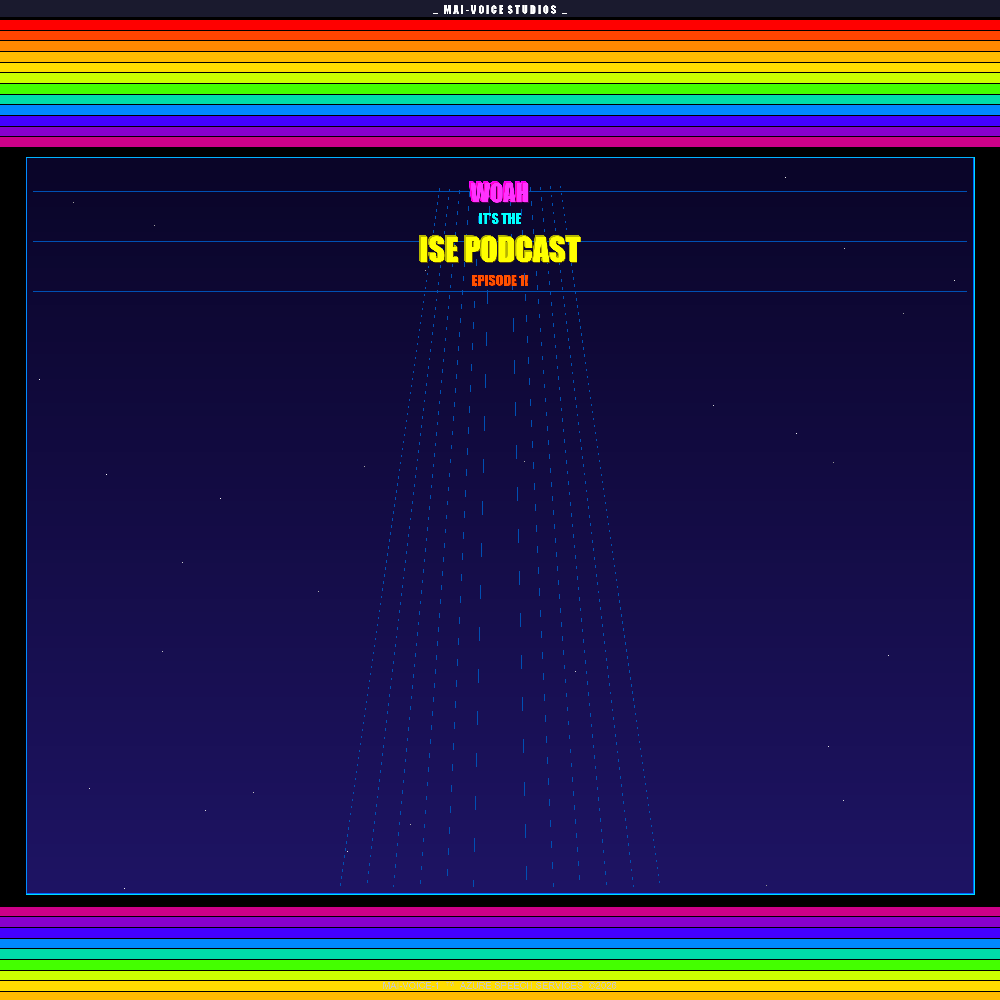

## Overview

This repo turns a plain text script into a fully produced podcast episode. You write dialogue for two characters, and the toolchain handles the rest: synthesis via Azure's MAI-Voice-1 voices, a generated intro and outro jingle, and packaging into an MP3 with embedded cover art.

A GitHub Copilot agent included in this repo guides you through every step interactively. Open the project in VS Code with GitHub Copilot enabled, select the **MAI Podcast Producer** agent, and follow the prompts.

## Prerequisites

Before you start, make sure you have the following.

### Local tools

- Python 3.10 or later
- [ffmpeg](https://ffmpeg.org/download.html) on your system PATH (required for MP3 export)
  - Windows: `winget install Gyan.FFmpeg`
  - Mac: `brew install ffmpeg`
  - Linux: `sudo apt install ffmpeg`
- Visual Studio Code with the [GitHub Copilot](https://marketplace.visualstudio.com/items?itemName=GitHub.copilot) extension

### Azure resources

- An active Azure subscription
- An **Azure AI Foundry Hub** with a Speech resource provisioned
- **MAI-Voice-1** model deployed on that Speech resource (may require access request in your region)

> [!IMPORTANT]
> MAI-Voice-1 is a premium voice model available through Azure AI Foundry. It is not available on standalone Speech resources created outside of AI Foundry. See [Stage 2 of the agent workflow](#getting-started-with-the-copilot-agent) for setup guidance.

## Repository structure

```text
.
├── synthesize.py          # Converts a script to WAV via Azure TTS
├── add_jingle.py          # Wraps WAV with generated intro + outro jingles
├── package_mp3.py         # Converts WAV to MP3 with cover art and ID3 tags
├── requirements.txt       # Python dependencies
├── .env.example           # Credential template — copy to .env and fill in
├── scripts/
│   ├── podcast-demo.txt   # Example script in text format
│   └── dialogue-demo.json # Example script in JSON format
└── .github/
    └── agents/
        └── mai-podcast.agent.md  # Copilot agent for the full workflow
```

## Getting started with the Copilot agent

1. Clone the repo and open the folder in VS Code.
2. Open GitHub Copilot Chat.
3. Click the agent picker and select **MAI Podcast Producer**.
4. The agent walks you through seven stages:

| Stage | What happens |
|-------|-------------|
| 1 | Set up the Python virtual environment and install dependencies |
| 2 | Configure Azure credentials and enable MAI-Voice-1 |
| 3 | Write or choose a podcast script |
| 4 | Synthesize the script to WAV using Azure TTS |
| 5 | Add intro and outro jingles |
| 6 | Export the final MP3 with cover art |
| 7 | Verify all output files |

## Running the scripts manually

If you prefer to run the pipeline yourself, here is the full sequence after completing environment and credential setup.

**Synthesize your script:**

```bash
python synthesize.py scripts/podcast-demo.txt -o output/speech.wav -a iris -b grant
```

**Add jingles:**

```bash
python add_jingle.py output/speech.wav output/podcast-with-jingles.wav
```

**Package as MP3:**

```bash
python package_mp3.py output/podcast-with-jingles.wav output/podcast.mp3
```

## Script format

Two formats are supported.

**Text (`.txt`) — recommended for handwritten scripts:**

```text
# A = Iris (female), B = Grant (male)
# Format: CHARACTER: text   or   CHARACTER (style): text
A (excitement): Welcome to the show!
B: Thanks for having me.
A (happiness): Let's dive right in.
```

**JSON (`.json`) — useful for programmatic generation:**

```json
[
  {"character": "A", "text": "Welcome to the show!", "style": "excitement"},
  {"character": "B", "text": "Thanks for having me."}
]
```

Characters must be `A` or `B`. Supported styles include: `excitement`, `happiness`, `fear`, `professional`, `determination`, `cheerful`, `sad`, `newscast`.

## Available voices

| Name   | Voice ID                 | Character |
|--------|--------------------------|-----------|
| iris   | en-US-Iris:MAI-Voice-1   | Female    |
| grant  | en-US-Grant:MAI-Voice-1  | Male      |
| jasper | en-US-Jasper:MAI-Voice-1 | Male      |
| june   | en-US-June:MAI-Voice-1   | Female    |

## Credentials

Copy `.env.example` to `.env` and fill in your Azure details. Two auth methods are supported.

**API key:**

```env
SPEECH_KEY=your-azure-speech-key-here
SPEECH_REGION=eastus
```

**Token auth via `az login` (no key required):**

```env
SPEECH_ENDPOINT=https://your-resource-name.cognitiveservices.azure.com
SPEECH_REGION=eastus
```

> [!WARNING]
> Never commit `.env` to source control. It is already excluded in `.gitignore`.

## Cover art customization

The cover art is a 3000×3000 PNG generated entirely in Python with a retro 80s Activision/Atari 2600 aesthetic: rainbow horizontal stripes, a Tron-style perspective grid, neon text, and a starfield. This resolution meets the preferred spec for Apple Podcasts and Spotify.



All text on the cover, plus the MP3 metadata embedded as ID3 tags, is controlled by `cover.json` in the root of the repo. Edit that file before running `package_mp3.py` each episode:

```json
{
  "cover": {
    "studio_banner": "▶  M A I - V O I C E  S T U D I O S  ▶",
    "exclamation": "WOAH",
    "subtitle": "IT'S THE",
    "show_title": "ISE PODCAST",
    "episode": "EPISODE 1!",
    "footer": "MAI-VOICE-1  ™  AZURE SPEECH SERVICES  ©2026"
  },
  "metadata": {
    "title": "ISE Podcast Episode 1",
    "subtitle": "A deep-dive into AI voice technology",
    "artist": "MAI-Voice-1",
    "album": "ISE Podcast",
    "album_artist": "ISE",
    "year": "2026",
    "track": "1",
    "genre": "Podcast",
    "publisher": "ISE",
    "author_url": "",
    "copyright": "© 2026 ISE",
    "comment": "Produced using Azure MAI-Voice-1 voices.",
    "podcast_feed_url": ""
  }
}
```

| Field | Where it appears |
|-------|-----------------|
| `cover.studio_banner` | Dark bar at very top of the image |
| `cover.exclamation` | Large magenta/pink neon text |
| `cover.subtitle` | Cyan line beneath the exclamation |
| `cover.show_title` | Large yellow main title |
| `cover.episode` | Orange episode line |
| `cover.footer` | Small grey text at the bottom |
| `metadata.title` | MP3 title tag (shown in media players) |
| `metadata.subtitle` | MP3 subtitle / episode description |
| `metadata.artist` | MP3 artist tag |
| `metadata.album` | MP3 album / show name tag |
| `metadata.album_artist` | MP3 album artist tag |
| `metadata.year` | MP3 year tag |
| `metadata.track` | Episode number |
| `metadata.genre` | Genre tag (default: `Podcast`) |
| `metadata.publisher` | Publisher/network name |
| `metadata.author_url` | URL link to author or show website |
| `metadata.copyright` | Copyright string |
| `metadata.comment` | Episode description (read by iTunes) |
| `metadata.podcast_feed_url` | RSS feed URL (enables Apple Podcasts auto-subscribe) |

> [!TIP]
> For each new episode, update `cover.episode` and `metadata.title`, then re-run `package_mp3.py`. Everything else stays the same until your show name changes.

## Output files

All generated files land in the `output/` directory, which is excluded from version control by `.gitignore`.

| File | Description |
|------|-------------|
| `output/speech.wav` | Raw synthesized audio (48 kHz, 16-bit mono PCM) |
| `output/podcast-with-jingles.wav` | Audio with intro and outro jingles |
| `output/cover.png` | Generated retro cover art (3000×3000 PNG) |
| `output/podcast.mp3` | Final MP3 (48 kHz, stereo, 192 kbps, ID3v2.3 tags + cover) |

For the rationale behind these format choices, see [docs/output-spec.md](docs/output-spec.md).

## License

MIT — see [LICENSE](LICENSE).

## Contributing

See [CONTRIBUTING.md](CONTRIBUTING.md).
